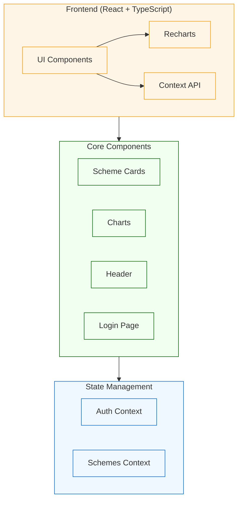

# Maharashtra Scheme Visualizer

A modern dashboard application built to visualize and track the performance of various government schemes in Maharashtra. This project provides an intuitive interface for both administrators and general users to monitor KPIs (Key Performance Indicators) across different government initiatives.

## System Architecture



## Data Flow

```mermaid
sequenceDiagram
    participant U as User
    participant AC as Auth Context
    participant SC as Schemes Context
    participant CP as Components
    participant CH as Charts

    style U fill:#fff5e6,stroke:#ff9900
    style AC fill:#f0f8ff,stroke:#0066cc
    style SC fill:#f0f8ff,stroke:#0066cc
    style CP fill:#f0fff0,stroke:#006400
    style CH fill:#f0fff0,stroke:#006400

    U->>AC: Login (Admin/General)
    AC->>U: Auth Status
    U->>SC: Request Scheme Data
    SC->>CP: Provide Scheme Data
    CP->>CH: Transform Data
    CH->>U: Render Visualizations
```

## Features

- **Interactive Dashboard**: Visualize scheme performance through various chart types:
  - Bar Charts
  - Line Charts
  - Gauge Charts
  - Pie Charts

- **Role-Based Access**:
  - Administrator view
  - General User view

- **Scheme Categories**:
  - Public Service Delivery
  - Economic Growth & Financial Management
  - Environmental Protection & Sustainability
  - And more...

- **Real-time KPI Tracking**:
  - Current values vs. Target values
  - Historical trend analysis
  - Performance metrics
  - Unit-based measurements

- **Modern UI/UX**:
  - Responsive design
  - Clean and intuitive interface
  - Maharashtra government branding
  - Tailwind CSS styling

## Tech Stack

- **Frontend Framework**: React with TypeScript
- **Styling**: Tailwind CSS
- **Charts**: Recharts
- **State Management**: React Context
- **Build Tool**: Vite
- **Package Manager**: npm/bun

## Getting Started

### Prerequisites

- Node.js (v16 or higher)
- npm or bun

### Installation

1. Clone the repository:
   ```bash
   git clone [your-repository-url]
   cd maharashtra-scheme-visualizer
   ```

2. Install dependencies:
   ```bash
   npm install
   # or
   bun install
   ```

3. Start the development server:
   ```bash
   npm run dev
   # or
   bun dev
   ```

4. Open your browser and navigate to:
   ```
   http://localhost:5173
   ```

## Project Structure

```
maharashtra-scheme-visualizer/
├── src/
│   ├── components/        # Reusable UI components
│   ├── contexts/         # React context providers
│   ├── pages/           # Page components
│   ├── data/           # Data files and types
│   └── styles/         # Global styles
├── public/             # Static assets
└── ...config files
```

## Usage

1. **Login**: Select your role (Administrator/General User)
2. **Dashboard**: View scheme performance metrics
3. **Interact**: Explore different charts and KPIs
4. **Monitor**: Track progress against targets

## Contributing

1. Fork the repository
2. Create your feature branch (`git checkout -b feature/AmazingFeature`)
3. Commit your changes (`git commit -m 'Add some AmazingFeature'`)
4. Push to the branch (`git push origin feature/AmazingFeature`)
5. Open a Pull Request

## License

This project is licensed under the MIT License - see the LICENSE file for details.

## Acknowledgments

- Government of Maharashtra
- React and TypeScript communities
- Recharts library contributors
- Tailwind CSS team

## Contact

For any queries regarding this project, please reach out to:
[Your Contact Information]

---

Built with ❤️ for Maharashtra
